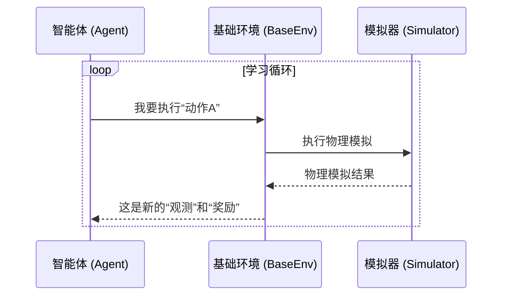

---
{"publish":true,"created":"2025-10-22T19:09:48.077-04:00","modified":"2025-10-22T19:12:38.240-04:00","tags":["ai","code2tutorial","diffusion","manipulation"],"cssclasses":""}
---


# Chapter 1: 基础环境 (BaseEnv)


欢迎来到 ProtoMotions 的世界！在这一章，我们将一起探索最核心的概念之一：`基础环境 (BaseEnv)`。

想象一下，我们要教一个机器人学习走路。我们不能直接在现实世界里训练它，因为那样太慢了，而且机器人摔倒了还可能损坏。所以，我们需要为它创造一个虚拟的“游乐场”。在这个游乐场里，它可以安全地、成千上万次地尝试、摔倒、再爬起来，直到学会为止。

这个虚拟的“游乐场”，在 ProtoMotions 中，就是 `BaseEnv`。

## 什么是 `BaseEnv`？

`BaseEnv` 是智能体（我们想要训练的 AI 大脑）进行学习和交互的世界。它定义了：
*   **游戏规则**：比如，机器人不能穿墙，碰到障碍物会摔倒。
*   **任务目标**：比如，是学习走路、跑步，还是模仿一个特定的舞蹈动作。
*   **得分方式**：机器人做得好，就给它“奖励”分；做得不好，就“惩罚”它。
*   **感知信息**：机器人能“看到”和“感觉到”什么，比如自己关节的位置，或者前方地面的高度。

简单来说，`BaseEnv` 是连接 **智能体大脑** 和 **物理世界（模拟器）** 的一座桥梁。智能体通过这座桥梁来观察世界，并根据观察到的信息做出决策（动作）；而环境则会执行智能体的动作，并告诉它这个动作带来了什么样的结果。

## `BaseEnv` 的核心交互流程

智能体和环境的互动就像一场回合制游戏，周而复始：

1.  **观察 (Observe)**：环境告诉智能体：“这是你现在看到的情况。” (例如，你的左脚在这里，右脚在那里，地面是平的。)
2.  **行动 (Act)**：智能体根据观察到的情况，决定下一步该怎么做：“好的，我决定要抬起左脚。”
3.  **反馈 (Feedback)**：环境在模拟器中执行这个动作，然后告诉智能体结果：“你成功抬起了左脚，并且保持了平衡，做得不错！奖励你1分。”
4.  **循环 (Loop)**：回到第1步，智能体根据新的情况，继续做下一个决定。

如果智能体摔倒了（或者达到了游戏设定的最长时间），环境就会“重置” (Reset) 一切，让智能体从头再来一局。

我们可以用一个简单的图来表示这个过程：



这个循环就是强化学习的核心。通过不断地试错和获取奖励，智能体的大脑会慢慢“进化”，学会如何做出更高明的决策来获得更多的奖励，最终达成我们的任务目标（比如学会走路）。

## `BaseEnv` 的配置：设计你的“游乐场”

我们不是从零开始编写代码来创建环境的，而是通过修改一个叫做 YAML 的配置文件来“设计”它。这就像玩乐高一样，我们把不同的组件拼在一起，而不是自己去制造每一个砖块。

让我们来看一个简化的配置文件 `protomotions/config/env/base_env.yaml`：

```yaml
# env 是我们对环境的主要配置
env:
  # 总共有多少个环境在同时运行？（可以同时训练多个机器人）
  num_envs: ${num_envs}
  # 每个机器人最多能活多久（单位是“步”）
  max_episode_length: 300

  # 关于机器人自身的观测信息配置
  humanoid_obs:
    use_max_coords_obs: True
    local_root_obs: True
  
  # 机器人摔倒的判断标准
  termination_height: 0.15
  enable_height_termination: False
```

这里的每一项配置都像是在设定游乐场的规则：
*   `num_envs`: 指定了我们要同时开启多少个游乐场。并行训练可以大大加快学习速度。
*   `max_episode_length`: 规定了每一局游戏的最长持续时间。时间到了，游戏就会自动重置。
*   `humanoid_obs`: 定义了机器人能“看到”什么。比如，它能感知到自己身体各部分相对于躯干的局部位置 (`local_root_obs`)。
*   `termination_height`: 定义了“游戏结束”的条件之一。比如，如果机器人某个关键部位的高度低于0.15米，我们就判断它摔倒了，需要重置。

通过调整这些参数，我们可以创建出各种各样适合不同任务的环境。

## 深入 `BaseEnv` 的内部工作

现在，让我们稍微深入一点，看看 `BaseEnv` 在代码层面是如何工作的。主要逻辑位于 `protomotions/envs/base_env/env.py` 文件中。

### 1. 初始化 (`__init__`)

当一个 `BaseEnv` 被创建时，它的 `__init__` 方法会执行一系列初始化工作，就像是搭建游乐场的施工过程。

```python
# 文件: protomotions/envs/base_env/env.py

class BaseEnv:
    def __init__(self, config, device: torch.device, *args, **kwargs):
        self.config = config # 加载我们的 YAML 配置
        self.num_envs = self.config.num_envs # 从配置中读取环境数量

        # 创建地形，比如平地或者山坡
        self.create_terrain_and_scene_lib()

        # 实例化一个模拟器，这是物理世界的核心
        # 它将处理所有物理计算
        # 注意：我们将在下一章详细讲解“模拟器抽象层”
        self.simulator: Simulator = SimulatorClass(...)
        
        # ... 其他初始化，比如创建观测和奖励的缓冲区 ...
        self.rew_buf = torch.zeros(self.num_envs, ...)
        self.reset_buf = torch.ones(self.num_envs, ...)
```
这段代码做了几件重要的事情：
*   读取我们之前看到的 YAML 配置文件。
*   根据配置创建地形。
*   初始化一个 [模拟器抽象层 (Simulator Abstraction)](02_模拟器抽象层__simulator_abstraction__.md)，这是真正执行物理计算的地方。`BaseEnv` 只是向它下达指令。
*   准备一些“缓冲区”（`rew_buf`, `reset_buf`），用来存放每个环境的奖励和重置状态。

### 2. 步进 (`step`)

`step` 方法是环境的心脏，它驱动着整个交互循环。每次智能体给出一个动作，我们就会调用这个方法。

```python
# 文件: protomotions/envs/base_env/env.py

    def step(self, actions):
        # 1. 对动作进行预处理
        actions = self.pre_physics_step(actions)

        # 2. 将动作发送给模拟器，并让物理世界前进一小步
        self.simulator.step(actions, ...)

        # 3. 物理模拟结束后，进行后续处理
        self.post_physics_step()

        # 4. 返回新的观测、奖励和重置信号
        return self.get_obs(), self.rew_buf, self.reset_buf, self.extras
```

`step` 函数的流程非常清晰：
1.  `pre_physics_step`: 在物理模拟前，可以对动作进行一些处理。
2.  `simulator.step`: 把最终的动作交给模拟器去执行。这是最关键的一步，模拟器会计算出动作执行后，机器人和世界变成了什么样。
3.  `post_physics_step`: 在物理模拟后，`BaseEnv` 会根据模拟的结果计算奖励、判断是否需要重置，并准备好下一次的观测数据。
    ```python
    # 文件: protomotions/envs/base_env/env.py
    def post_physics_step(self):
        self.progress_buf += 1 # 游戏时间+1

        # 计算智能体能看到什么
        self.compute_observations()
        # 计算智能体应得多少奖励
        self.compute_reward()
        # 检查智能体是否摔倒或者超时
        self.compute_reset()
    ```
4.  **返回结果**：最后，将新的状态打包返回给智能体。

### 3. 重置 (`reset`)

当 `compute_reset` 函数检测到某个环境需要重置时（比如机器人摔倒了），`reset` 方法就会被调用，把这个环境恢复到初始状态。

```python
# 文件: protomotions/envs/base_env/env.py

    def reset(self, env_ids=None):
        # ...
        if self.state_init == self.StateInit.Default:
            # 默认重置方式：将机器人重置到一个预设的站立姿势
            new_states = self.reset_default(env_ids)
        elif self.state_init == self.StateInit.Data:
            # 数据重置方式：从动作库中随机抽取一个姿势来开始
            new_states, _, _ = self.reset_ref_state_init(env_ids)
        
        # ...
        
        # 让模拟器将指定环境中的机器人状态设置为 new_states
        self.simulator.reset_envs(new_states, env_ids)

        # 重置一些计数器
        self.progress_buf[env_ids] = 0
        self.reset_buf[env_ids] = 0
```
`reset` 提供了不同的初始化策略。例如，`Default` 模式让机器人每次都从一个标准的站立姿势开始，而 `Data` 模式则会让它从一个真实的 [动作库 (MotionLib)](04_动作库__motionlib__.md) 中随机采样一个姿势开始。这增加了训练的多样性，让智能体学会从各种姿态中恢复和行动，从而变得更加鲁棒。

## 总结

在本章中，我们学习了 ProtoMotions 的核心概念——`基础环境 (BaseEnv)`。

*   我们了解到，`BaseEnv` 是智能体学习的“游乐场”，它定义了游戏规则、任务目标和反馈机制。
*   我们探讨了智能体与环境之间的核心交互循环：观察 -> 行动 -> 反馈。
*   我们通过 YAML 配置文件了解了如何定制化我们的环境。
*   我们还深入代码，了解了 `__init__`、`step` 和 `reset` 这三个关键方法的内部工作原理。

`BaseEnv` 扮演着“总指挥”的角色，它协调着智能体、模拟器、地形、动作数据等多个组件。它为智能体的学习提供了一个清晰、结构化的框架。

现在你已经理解了“游乐场”的运作方式。但这个游乐场里的沙子、秋千和滑梯是如何真实运作的呢？这就要靠我们的物理引擎了。在下一章中，我们将深入幕后，探索为 `BaseEnv` 提供物理模拟支持的关键部分：[模拟器抽象层 (Simulator Abstraction)](02_模拟器抽象层__simulator_abstraction__.md)。

---

Generated by [AI Codebase Knowledge Builder](https://github.com/The-Pocket/Tutorial-Codebase-Knowledge)