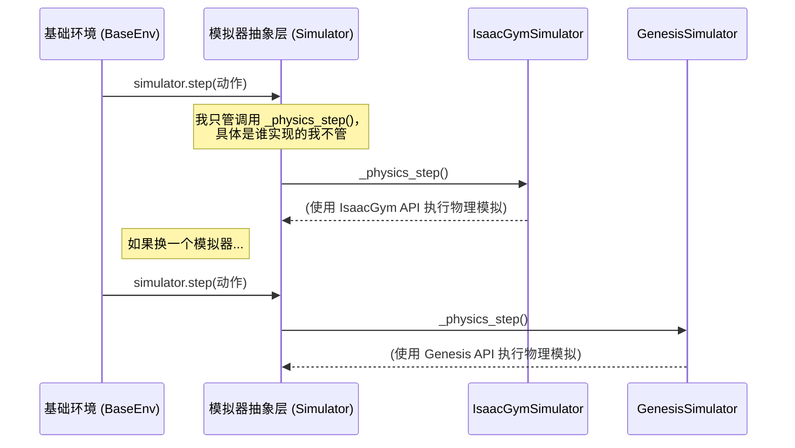

---
{"publish":true,"created":"2025-10-22T19:09:48.056-04:00","modified":"2025-11-02T15:44:08.953-05:00","tags":["ai","code2tutorial","diffusion","manipulation"],"cssclasses":""}
---


# Chapter 2: 模拟器抽象层 (Simulator Abstraction)


在上一章 [基础环境 (BaseEnv)](01_基础环境__baseenv__.md) 中，我们把 `BaseEnv` 比作一个虚拟“游乐场”。我们是这个游乐场的设计师，负责制定规则和目标。但是，游乐场里的秋千为什么会摆动？沙子为什么会流动？这些都遵循着物理定律。在我们的虚拟世界里，负责执行这些物理定律的就是**物理模拟器**。

`ProtoMotions` 的强大之处在于它不依赖于某一个特定的物理模拟器。它就像一个多才多艺的建筑师，既能使用 IsaacGym 这套工具，也能熟练运用 Genesis 或 IsaacLab。但问题来了：每套工具（每个模拟器）都有自己独特的使用说明书和操作方式（也就是 API）。我们总不能在 `BaseEnv` 的代码里为每个模拟器都写一套不同的指令吧？那代码会变得一团糟！

为了解决这个问题，`ProtoMotions` 设计了一个非常巧妙的结构，这就是我们本章的主角：**模拟器抽象层**。

## 什么是模拟器抽象层？

想象一下你是一位环球旅行家，你的电子设备需要充电。美国的插座是两扁一圆，欧洲是两圆，英国是三扁。如果你每到一个国家就要换一个充电器，那太麻烦了。一个聪明的解决方案是带一个“万能转换插头”。你只需要把你的充电器插到这个转换头上，转换头就能适配任何国家的插座。

**模拟器抽象层就是这个“万能转换插头”**。

-   **你的电子设备**：就是我们的 `BaseEnv`。
-   **不同国家的插座**：就是不同的物理模拟器（IsaacGym, Genesis, ...）。
-   **万能转换插头**：就是模拟器抽象层。

它提供了一套统一、标准的“插口”（接口），让 `BaseEnv` 可以用同一种方式下达指令，比如“让物理世界前进一步”或者“获取机器人的位置”。而抽象层内部则负责将这些标准指令“翻译”成特定模拟器能听懂的语言。


这样一来，`BaseEnv` 就完全不需要关心底层到底用的是哪个模拟器。它只管和这个“万能转换插头”对话，从而实现了代码的解耦和高度的可扩展性。

## 抽象层如何工作？

这个“万能转换插头”的设计主要包含两个部分：一个**统一的指令集**和一个**具体的翻译器**。

### 1. 统一的指令集 (接口) - `Simulator` 基类

`ProtoMotions` 定义了一个叫做 `Simulator` 的“抽象基类”（Abstract Base Class）。你可以把它想象成“万能转换插头”的设计蓝图。这张蓝图规定了所有转换插头都必须具备哪些功能（方法），比如：

-   `step(actions)`：接收智能体的动作，让物理世界模拟一小段时间。
-   `reset_envs(states, env_ids)`：将指定环境中的机器人重置到某个状态。
-   `get_root_state()`：获取机器人的根节点状态（位置、旋转、速度）。
-   `get_bodies_state()`：获取机器人所有身体部位的状态。

这个基类位于 `protomotions/simulator/base_simulator/simulator.py`。它使用了 `@abstractmethod` 装饰器来定义这些必须被实现的功能。

```python
# 文件: protomotions/simulator/base_simulator/simulator.py

from abc import ABC, abstractmethod

class Simulator(ABC):
    # ... 其他初始化代码 ...

    def step(self, common_actions: torch.Tensor, ...):
        """ 这是 BaseEnv 调用的公共方法 """
        # ... 做一些通用准备工作 ...
        self._physics_step() # 调用下面那个必须被实现的私有方法
        # ... 做一些通用收尾工作 ...
        self.render()

    @abstractmethod
    def _physics_step(self) -> None:
        """
        推进物理模拟。
        这是一个“抽象”方法，它没有具体实现，
        需要由具体的模拟器子类去实现。
        """
        raise NotImplementedError

    @abstractmethod
    def _get_simulator_root_state(self, ...) -> RobotState:
        """
        获取模拟器原始的根节点状态。
        这也是一个抽象方法。
        """
        raise NotImplementedError
```
注意，像 `_physics_step` 这样的方法被标记为 `abstractmethod`，意味着 `Simulator` 类本身并不知道具体该如何推进物理世界，它只是定下了一个规矩：“任何想要成为我的‘翻译器’的类，都必须告诉我具体怎么做！”

### 2. 具体的翻译器 - `IsaacGymSimulator`, `GenesisSimulator` 等

针对 `ProtoMotions` 支持的每一种物理引擎，都有一个具体的类继承自 `Simulator` 基类，并实现了所有抽象方法。这些就是我们真正的“翻译器”。

-   `protomotions/simulator/isaacgym/simulator.py` -> `IsaacGymSimulator`
-   `protomotions/simulator/genesis/simulator.py` -> `GenesisSimulator`
-   `protomotions/simulator/isaaclab/simulator.py` -> `IsaacLabSimulator`

让我们来看看 `_physics_step` 这个方法在两个不同“翻译器”中的具体实现有何不同：

**对于 IsaacGym:**
```python
# 文件: protomotions/simulator/isaacgym/simulator.py

class IsaacGymSimulator(Simulator):
    def _physics_step(self) -> None:
        # ...
        self._simulate() # 调用 IsaacGym 的 simulate 函数
        # ...
    
    def _simulate(self) -> None:
        self._gym.simulate(self._sim) # <- IsaacGym 的原生指令
```

**对于 Genesis:**
```python
# 文件: protomotions/simulator/genesis/simulator.py

class GenesisSimulator(Simulator):
    def _physics_step(self) -> None:
        for i in range(self.decimation):
            # ...
            self._scene.step() # <- Genesis 的原生指令
```

看到了吗？`BaseEnv` 只是简单地调用了 `simulator.step()`，但根据我们选择的模拟器不同，底层实际执行的代码是完全不一样的！`IsaacGymSimulator` 调用了 `self._gym.simulate()`，而 `GenesisSimulator` 调用了 `self._scene.step()`。抽象层完美地隐藏了这些差异。

这个过程可以用下面的流程图来表示：


## 统一数据格式：`RobotState`

除了统一指令，抽象层还解决了另一个重要问题：**统一数据格式**。

不同的模拟器不仅 API 不同，它们返回的数据结构、坐标系（例如，四元数的顺序是 `wxyz` 还是 `xyzw`）、关节和身体部位的排序等都可能不一样。

为了解决这个问题，抽象层定义了一个标准的数据容器：`RobotState`。

```python
# 文件: protomotions/simulator/base_simulator/robot_state.py

@dataclass
class RobotState:
    # 根节点状态
    root_pos: torch.Tensor
    root_rot: torch.Tensor
    root_vel: torch.Tensor
    root_ang_vel: torch.Tensor
    
    # 关节状态
    dof_pos: torch.Tensor
    dof_vel: torch.Tensor
    
    # 刚体状态
    rigid_body_pos: torch.Tensor
    rigid_body_rot: torch.Tensor
    # ... 等等
```

无论底层用的是哪个模拟器，当 `BaseEnv` 调用 `simulator.get_root_state()` 或 `simulator.get_bodies_state()` 时，它收到的永远是一个格式统一的 `RobotState` 对象。

那么，“翻译”是在哪里发生的呢？

在每个具体的模拟器实现中，获取数据的方法会先拿到模拟器的“原生”数据，然后通过一个 `convert_to_common` 方法将其转换为标准格式。

```python
# 文件: protomotions/simulator/base_simulator/simulator.py

class Simulator(ABC):
    def get_root_state(self, ...) -> RobotState:
        # 1. 调用抽象方法，让具体的模拟器子类去获取原生数据
        simulator_root_state: RobotState = self._get_simulator_root_state(env_ids)
        
        # 2. 将原生数据转换为通用、标准的格式
        simulator_root_state = simulator_root_state.convert_to_common(self.data_conversion)
        
        return simulator_root_state

    @abstractmethod
    def _get_simulator_root_state(self, ...) -> RobotState:
        # 这个方法由 IsaacGymSimulator 等子类实现
        raise NotImplementedError
```
这个 `data_conversion` 对象包含了所有必要的转换信息，比如关节顺序的映射关系、四元数格式等，确保了 `BaseEnv` 收到的数据永远是标准、可靠的。

## 总结

在本章中，我们揭开了 `ProtoMotions` 物理模拟背后的秘密武器——模拟器抽象层。

-   我们理解了它的核心价值：**像一个“万能转换插头”，让 `BaseEnv` 可以与任何支持的物理模拟器无缝对接**，而无需关心底层的具体实现。
-   我们学习了它的设计模式：一个定义了**统一接口**的抽象基类 `Simulator`，以及多个为特定模拟器提供**具体实现**的子类（如 `IsaacGymSimulator`）。
-   我们还了解了它如何通过 `RobotState` 数据类和转换逻辑来**统一不同模拟器的数据格式**，为上层应用提供了极大的便利。

这个抽象层是 `ProtoMotions` 模块化和可扩展性的基石。它不仅让代码更整洁、更易于维护，也为未来集成更多新型物理模拟器打开了大门。

现在，我们已经有了“游乐场” (`BaseEnv`) 和驱动它的“物理规律” (模拟器抽象层)。接下来，我们需要为游乐场请来主角——机器人。这个机器人是如何定义的？它的骨骼和姿态又是如何表示的呢？下一章，我们将深入探讨 [骨骼与姿态表示 (poselib)](03_骨骼与姿态表示__poselib__.md)。

---

Generated by [AI Codebase Knowledge Builder](https://github.com/The-Pocket/Tutorial-Codebase-Knowledge)