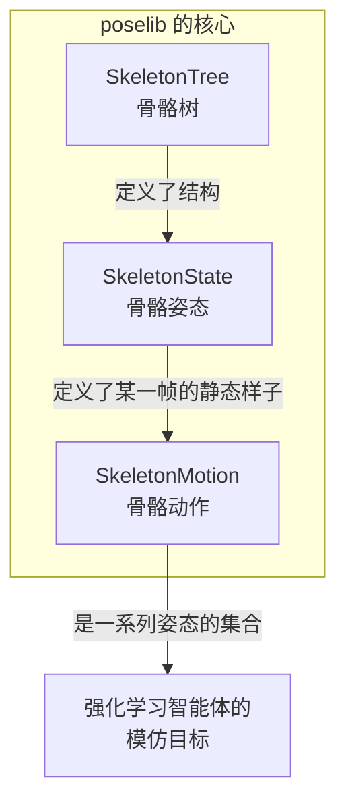
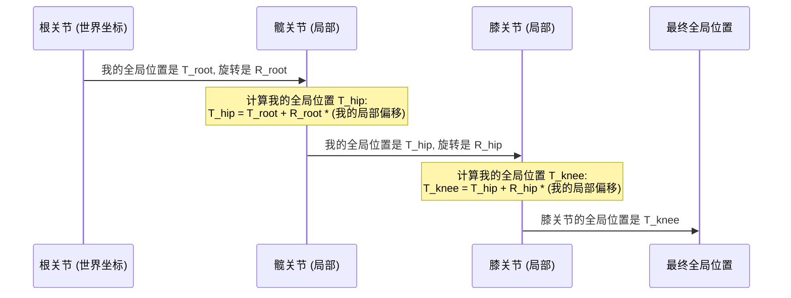

---
{"publish":true,"created":"2025-10-22T19:09:48.088-04:00","modified":"2025-11-02T15:44:14.792-05:00","tags":["ai","code2tutorial","diffusion","manipulation"],"cssclasses":""}
---


# Chapter 3: 骨骼与姿态表示 (poselib)


在前面的章节中，我们已经搭建好了智能体学习的“游乐场” ([基础环境 (BaseEnv)](01_基础环境__baseenv__.md))，并了解了驱动这个游乐场运转的“物理规律” ([模拟器抽象层 (Simulator Abstraction)](02_模拟器抽象层__simulator_abstraction__.md))。现在，是时候邀请我们的主角——虚拟角色——登场了。

但是，我们该如何向计算机描述一个虚拟角色呢？它有哪些关节？这些关节是如何连接的？它又是如何做出各种姿态和动作的？

要回答这些问题，我们需要一个精确的“身体蓝图”。在 `ProtoMotions` 中，这个蓝图就是由 `poselib` 库提供的。

## 什么是 `poselib`？

想象一下你有一个用于绘画的木头艺术家模型。

*   这个模型的**结构**是固定的：它的头部连接着躯干，躯干连接着大腿，大腿连接着小腿。每个部件的长度也是固定的。这个固定的结构就是角色的**骨骼**。
*   你可以扭动它的关节，让它摆出各种**姿势**，比如站立、坐下或者奔跑的某个瞬间。这是一个静态的**姿态**。
*   如果你快速连续地改变它的姿势，并拍下一系列照片，连起来播放就是一段**动画**。这是一个连续的**动作**。

`poselib` 就是一个专门用来描述和操作这三样东西的工具库。它定义了：

1.  **角色的骨骼结构**：身体各部分的连接关系和层级。
2.  **角色的静态姿态**：在任意一个时间点，角色所有关节的角度和在世界中的位置。
3.  **角色的连续动作**：随时间变化的一系列姿态。

简单来说，`poselib` 是我们与虚拟角色身体打交道的语言。通过它，我们可以加载、修改、计算和表示任何关于角色身体形态的信息。

## `poselib` 的三大核心

`poselib` 主要由三个核心类构成，它们分别对应我们上面提到的三个概念：骨骼、姿态和动作。



让我们逐一认识它们。

### 1. `SkeletonTree` - 角色的“骨架蓝图”

`SkeletonTree` 是最基础的部分，它描述了一个角色的身体结构，而且这个结构在整个运行过程中是**不会改变的**。它就像一份详细的人体骨骼图，精确定义了：

*   **有哪些骨骼/关节** (node_names): 比如 "torso" (躯干), "left_hip" (左髋), "left_knee" (左膝)。
*   **它们的父子关系** (parent_indices): 比如 "left_knee" 的父关节是 "left_hip"，"left_hip" 的父关节是 "torso"。根节点（比如躯干）没有父关节。
*   **骨骼的偏移量** (local_translation): 子关节相对于父关节的位置偏移。比如膝盖相对于髋关节在三维空间中的固定位置。

让我们来看一个 `SkeletonTree` 对象的例子。我们可以从一个描述机器人模型的文件（如 MJCF）中加载它。

```python
# 文件: poselib/poselib/skeleton/skeleton3d.py

# 假设我们已经加载了一个 SkeletonTree 对象 `sk_tree`
# sk_tree = SkeletonTree.from_mjcf("path/to/humanoid.xml")

# 我们可以查看它的基本信息
print(f"关节名称: {sk_tree.node_names}")
print(f"父关节索引: {sk_tree.parent_indices}")
print(f"局部偏移: {sk_tree.local_translation[0]}") # 只打印第一个，保持简洁
```

**输出示例 (已简化):**
```
关节名称: ['pelvis', 'torso', 'head', 'left_thigh', 'left_shin', ...]
父关节索引: tensor([-1,  0,  1,  0,  3, ...])
局部偏移: tensor([0.0000, 0.0000, 0.8900])
```

这里的 `父关节索引` 告诉我们层级关系。比如，索引为 `1` 的关节 "torso" 的父关节是索引为 `0` 的 "pelvis"。"pelvis" 的父关节索引是 `-1`，意味着它是根节点。

`SkeletonTree` 是一切的基础。没有它，我们就无法理解一堆旋转和位置数据究竟代表了什么。

### 2. `SkeletonState` - 定格的“瞬间姿态”

如果说 `SkeletonTree` 是静态的骨架，那么 `SkeletonState` 就是给这个骨架注入了生命，让它摆出了一个具体的**姿势**。

`SkeletonState` 包含了两部分动态信息：

*   **根节点的位置和旋转** (Root Translation & Rotation): 整个角色在世界坐标系中的位置和朝向。
*   **所有关节的旋转** (Joint Rotations): 每个关节相对于其父关节的旋转角度。这通常用一种叫做“四元数” (Quaternion) 的数学工具来表示，它可以无歧义地描述三维旋转。

`SkeletonState` 将 `SkeletonTree` (骨架结构) 和这些动态的旋转、位移数据结合在一起，就构成了一个完整的、可以被渲染出来的角色姿态。

创建一个最简单的姿态——“零姿态”（所有关节都没有旋转，角色位于原点）：
```python
# 文件: poselib/poselib/skeleton/skeleton3d.py

# sk_tree 是我们之前创建的 SkeletonTree
# 创建一个所有关节都未旋转的初始姿态
zero_pose = SkeletonState.zero_pose(sk_tree)

print(f"关节数量: {zero_pose.num_joints}")
print(f"根节点位置: {zero_pose.root_translation}")
print(f"第一个关节的局部旋转: {zero_pose.local_rotation[0]}")
```

**输出:**
```
关节数量: 24
根节点位置: tensor([0., 0., 0.])
第一个关节的局部旋转: tensor([0., 0., 0., 1.])
```
这里的 `[0., 0., 0., 1.]` 是一个代表“无旋转”的四元数。

我们可以通过修改 `local_rotation` 来创造新的姿态。比如，让角色的某个关节弯曲90度。

### 3. `SkeletonMotion` - 连续的“动作序列”

单个 `SkeletonState` 只是一个静止的画面。当我们把许多 `SkeletonState` 按时间顺序排列起来，就得到了一个 `SkeletonMotion`，也就是一段连续的动作。

`SkeletonMotion` 本质上是一个 `SkeletonState` 的集合，但增加了一个时间维度。除了包含每一帧的姿态信息外，它还计算并存储了每个关节的**线速度**和**角速度**。这些速度信息对于物理模拟和强化学习训练至关重要。

```python
# 文件: poselib/poselib/skeleton/skeleton3d.py

# 假设我们有一系列的姿态 `skeleton_state_sequence`
# 我们可以从中创建一个动作
# fps (frames per second) 指的是每秒的帧数
motion = SkeletonMotion.from_skeleton_state(skeleton_state_sequence, fps=60)

# 除了姿态信息，我们还可以获取速度信息
print(f"动作总帧数: {len(motion)}")
print(f"第一帧的根节点速度: {motion.global_root_velocity[0]}")
```

**输出示例:**
```
动作总帧数: 300
第一帧的根节点速度: tensor([0.01, 0.00, 0.23])
```

在 `ProtoMotions` 中，智能体的模仿学习任务，其模仿的“专家数据”通常就是一个 `SkeletonMotion` 对象。智能体的目标就是学会控制角色，使其动作尽可能地接近这个专家动作。

## 深入理解：局部旋转与全局位置

`poselib` 中一个非常重要的概念是**局部 (local)** 与 **全局 (global)** 坐标系的转换。

*   **局部旋转** (`local_rotation`)：描述一个关节相对于其**父关节**的旋转。这非常直观，就像你弯曲手肘，是前臂相对于上臂在转动。我们定义姿态时，通常都是操作局部旋转。
*   **全局位置/旋转** (`global_translation`/`global_rotation`)：描述一个关节在**世界坐标系**中的最终位置和朝向。这是物理模拟器和渲染器需要的信息。

`poselib` 的核心功能之一，就是能够根据 `SkeletonTree` 和 `local_rotation`，自动计算出每个关节的全局位置。这个过程被称为**正向运动学 (Forward Kinematics)**。

它的工作原理就像一个链条：

1.  根关节的全局位置/旋转就是 `SkeletonState` 中定义的根节点位置/旋转。
2.  要计算第一个子关节（比如髋关节）的全局位置，需要先将它的局部偏移量（在 `SkeletonTree` 中定义）根据父关节（根关节）的全局旋转进行旋转，然后再加上父关节的全局位置。
3.  要计算膝关节的全局位置，又是在髋关节的全局位置基础上，重复上述过程。
4.  ……以此类推，直到计算完所有末端关节（如脚踝）。

我们可以用一个简单的图来表示这个计算链：

这个自动化的计算过程极其重要。它意味着我们只需要关心和定义相对简单的局部旋转，`poselib` 就能为我们处理复杂的全局坐标计算，并将结果提供给[模拟器抽象层 (Simulator Abstraction)](02_模拟器抽象层__simulator_abstraction__.md)使用。

## 总结

在本章中，我们学习了 `ProtoMotions` 中用于描述角色身体和动作的“蓝图”—— `poselib` 库。

*   我们了解到 `poselib` 通过三个核心类来工作：
    *   `SkeletonTree`：定义了角色**不变的骨骼结构**，是身体的静态蓝图。
    *   `SkeletonState`：结合骨骼结构与关节旋转，描述了一个**静态的、瞬间的姿态**。
    *   `SkeletonMotion`：由一系列 `SkeletonState` 组成，描述了一段**随时间变化的、连续的动作**。
*   我们探讨了**局部**和**全局**坐标系的概念，并理解了 `poselib` 如何通过正向运动学 (Forward Kinematics) 自动将我们定义的局部旋转转换为模拟器所需的全局位置。

`poselib` 为我们提供了一套强大而标准化的工具，来处理所有与角色姿态和动作相关的数据。它是连接动作捕捉数据、动画数据和强化学习环境的关键桥梁。

现在我们已经知道如何用 `SkeletonMotion` 来表示单个动作了。但是，在训练中，我们通常需要处理成百上千个不同的动作。我们如何高效地加载、管理并从中采样这些动作数据呢？下一章，我们将介绍 `ProtoMotions` 的动作数据管理器：[动作库 (MotionLib)](04_动作库__motionlib__.md)。

---

Generated by [AI Codebase Knowledge Builder](https://github.com/The-Pocket/Tutorial-Codebase-Knowledge)