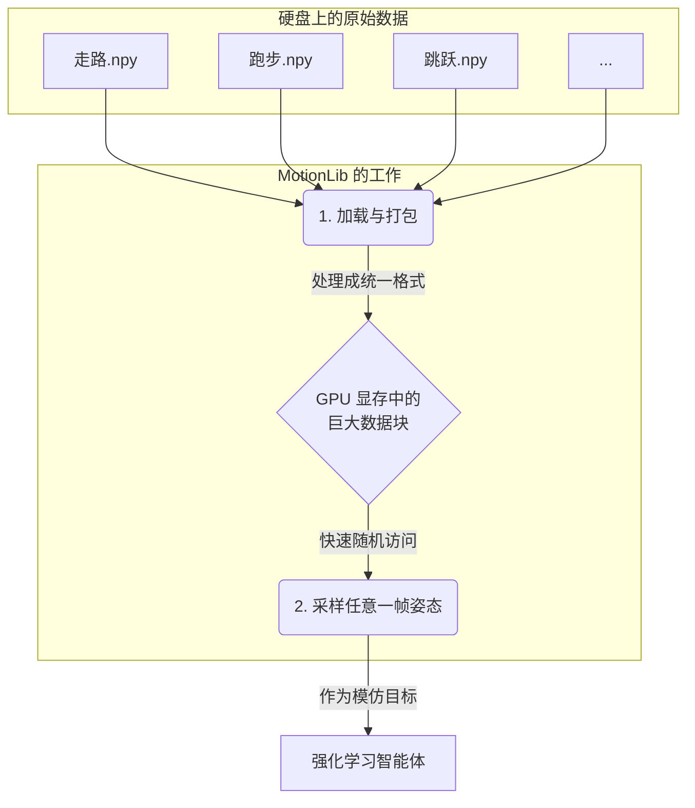
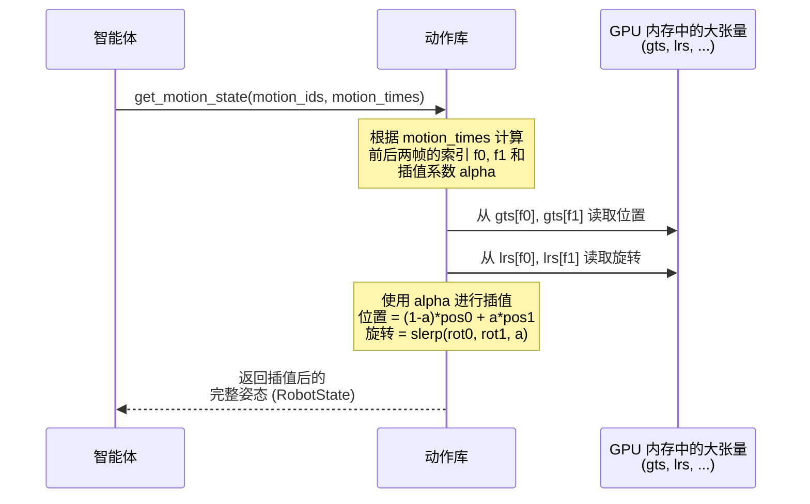

---
{"publish":true,"created":"2025-10-22T19:09:48.088-04:00","modified":"2025-11-02T15:44:20.548-05:00","tags":["ai","code2tutorial","diffusion","manipulation"],"cssclasses":""}
---


# Chapter 4: 动作库 (MotionLib)


在上一章 [骨骼与姿态表示 (poselib)](03_骨骼与姿态表示__poselib__.md) 中，我们学习了如何用 `SkeletonMotion` 来精确描述一段**单个**的动作，比如一次走路循环或一个跳跃动作。这就像是我们学会了如何抄写一首乐谱。

但是，如果我们想让智能体成为一个“舞蹈大师”，只学习一首曲子是远远不够的。我们需要一个庞大的音乐库，里面包含成百上千首风格各异的曲子，供它随时学习和模仿。

这个庞大的“动作音乐库”，在 `ProtoMotions` 中就是 `MotionLib`。

## 什么是 `MotionLib`？

`MotionLib` 是角色的“舞蹈动作库”。它的核心任务是高效地加载和管理大量的动作捕捉（mocap）数据。这些数据就像是专业舞者的动作录像，是智能体进行模仿学习的宝贵“教材”。

想象一下，你正在训练一个AI学习跳舞。你的训练数据可能包含：
*   100个走路的动作片段
*   80个跑步的动作片段
*   50个跳跃的动作片段
*   还有各种转身、挥手、坐下的动作...

如果每次训练时都去硬盘上一个个读取这些零散的文件，将会非常缓慢和低效。`MotionLib` 解决的正是这个问题。它就像一个智能的图书管理员，负责：

1.  **预处理与打包**：在训练开始前，`MotionLib` 会把所有零散的动作文件（比如 `.npy` 文件）读取进来，进行统一处理（如调整帧率、修正高度），然后打包成一个或几个大的文件。这就像把一堆散装的书籍整理成一本厚厚的大百科全书。
2.  **高效加载**：训练时，我们只需要加载这个打包好的“大百科全书”，一次性将所有动作数据放入内存（甚至直接放入 GPU 显存），极大地加快了启动速度。
3.  **快速采样**：在训练的每一步，智能体都需要一个“模仿目标”。`MotionLib` 能够以极高的速度从成千上万帧的动作数据中，随机抽取一个特定的姿态（比如“走路”动作的第0.5秒）作为参考。这个过程是在 GPU 上完成的，快如闪电。



## `MotionLib` 的使用方法

我们通常不是直接在代码里创建 `MotionLib`，而是通过配置文件来告诉它去哪里加载数据。

### 1. 定义你的动作数据集 (YAML)

`ProtoMotions` 使用一个 YAML 文件来定义一个动作数据集。这个文件列出了所有需要被加载的动作，以及它们的权重（被抽样到的概率）、截取时间等信息。

来看一个简化的例子 `data/yaml_files/example_motion.yaml`：
```yaml
# 这个文件描述了一个动作数据集
motions:
  - file: "smpl_humanoid_walk.npy" # 动作文件名
    weight: 1.0                   # 抽样权重
    timings: {start: 0, end: -1}  # 使用从开始(0)到结束(-1)的整个动作
  
  - file: "smpl_humanoid_run.npy"
    weight: 0.5                   # 跑步动作被抽到的概率是走路的一半
    sub_motions:                  # 还可以把一个长动作切成几段
      - idx: 0
        timings: {start: 0.2, end: 1.5} # 第一段：从0.2秒到1.5秒
      - idx: 1
        timings: {start: 1.8, end: 3.0} # 第二段：从1.8秒到3.0秒
```
这个配置文件非常灵活，你可以指定每个动作的权重，甚至可以从一个长文件中只截取你感兴趣的片段。

### 2. 在代码中加载和采样

在智能体的训练代码中，我们只需要将这个 YAML 文件的路径传递给 `MotionLib` 的构造函数。`MotionLib` 会自动完成所有的加载和处理工作。

```python
# 文件: protomotions/utils/motion_lib.py

# 简化版的初始化过程
motion_lib = MotionLib(
    motion_file="data/yaml_files/example_motion.yaml", # 传入配置文件
    robot_config=robot_config,                         # 机器人骨骼信息
    key_body_ids=key_body_ids,                         # 关心的身体部位ID
    device="cuda:0"                                    # 指定在GPU上运行
)
```
一旦 `motion_lib` 对象被创建，我们就可以在训练循环中轻松地采样参考姿态了。

```python
# 假设我们有 num_envs 个并行的环境
num_envs = 1024

# 1. 从库中随机抽取 `num_envs` 个动作的ID
#    权重越高的动作越容易被抽到
motion_ids = motion_lib.sample_motions(n=num_envs)

# 2. 为每个选中的动作随机生成一个时间点
motion_times = motion_lib.sample_time(motion_ids)

# 3. 获取在这些动作的这些时间点上的精确姿态
#    这是我们希望智能体模仿的目标
reference_state = motion_lib.get_motion_state(motion_ids, motion_times)
```
`get_motion_state` 会返回一个 `RobotState` 对象，里面包含了根节点位置、关节旋转、速度等所有智能体需要模仿的信息。这个过程因为所有数据都在 GPU 上，所以极其高效。

## `MotionLib` 的内部工作原理

那么，从一个 YAML 文件到一个可以在 GPU 上快速采样的 `reference_state`，中间到底发生了什么呢？

### 1. 加载与整合 (`_load_motions`)

当你创建 `MotionLib` 实例时，它会执行一个复杂的初始化流程：

1.  **解析 YAML**：`_fetch_motion_files` 方法会读取你的 YAML 文件，整理出一个包含所有动作文件路径、权重和时间片段的列表。
2.  **逐个加载**：它会遍历这个列表，使用 `_load_motion_file` 方法把每一个 `.npy` 文件加载成一个 [poselib](03_骨骼与姿态表示__poselib__.md) 中的 `SkeletonMotion` 对象。
3.  **处理与转换**：
    *   **调整帧率**：如果动作的原始帧率（比如120 FPS）高于我们的目标帧率（比如30 FPS），它会进行降采样以节省内存。
    *   **修正高度**：它会确保动作的最低点在地平面上，防止角色出现在地下。
    *   **计算速度**：计算出每个关节的角速度，这对于物理模拟和奖励计算非常重要。
4.  **数据大合并**：这是最关键的一步。它不会将几百个 `SkeletonMotion` 对象作为独立的个体来存储，而是将它们的数据“拉平”并拼接成几个巨大的张量（Tensor）。
    *   所有动作的所有帧的**全局位置**数据被合并到 `self.gts` (global translations)。
    *   所有动作的所有帧的**局部旋转**数据被合并到 `self.lrs` (local rotations)。
    *   ... 其他数据（如速度）也同样处理。

最后，所有这些巨大的张量都被移动到你指定的设备上（通常是 GPU）。

### 2. 采样与插值 (`get_motion_state`)

当你在训练中调用 `get_motion_state` 时，它执行的是一个纯粹的 GPU 计算过程，非常快。



这个过程的核心是**插值**。因为我们采样的 `motion_times` 是连续的（比如 1.23秒），而我们的数据是离散的（比如在第1.2秒和第1.26秒有数据帧）。`MotionLib` 会：

1.  **计算帧索引**：根据 `motion_times`，计算出它之前和之后最近的两个数据帧的索引，我们称之为 `frame_idx0` 和 `frame_idx1`。
2.  **计算混合系数**：计算出时间点在这两帧之间的位置，得到一个 0 到 1 之间的混合系数 `blend`。
3.  **获取数据**：用这两个帧索引去巨大的张量 `gts`, `lrs` 中取出对应的数据。

    ```python
    # 文件: protomotions/utils/motion_lib.py (简化版)
    # 计算帧索引和混合系数
    frame_idx0, frame_idx1, blend = self._calc_frame_blend(...)
    
    # 加上每个动作在整个大张量中的起始位置
    f0l = frame_idx0 + self.length_starts[motion_ids]
    f1l = frame_idx1 + self.length_starts[motion_ids]

    # 从大张量中取出两帧的数据
    root_pos0 = self.gts[f0l, 0]
    root_pos1 = self.gts[f1l, 0]
    local_rot0 = self.lrs[f0l]
    local_rot1 = self.lrs[f1l]
    ```
4.  **进行插值**：
    *   对于位置和速度等线性数据，使用简单的线性插值。
    *   对于旋转（四元数），使用一种叫做 `slerp`（球面线性插值）的特殊方法，以确保旋转的平滑过渡。

    ```python
    # 文件: protomotions/utils/motion_lib.py (简化版)
    blend = blend.unsqueeze(-1) # 增加一个维度以匹配数据形状

    # 线性插值位置
    root_pos = (1.0 - blend) * root_pos0 + blend * root_pos1

    # 球面线性插值旋转
    local_rot = torch_utils.slerp(local_rot0, local_rot1, ...)
    ```

通过这个过程，`MotionLib` 可以在 O(1) 的时间内（即与动作库大小无关的常数时间）获取到任意时间点的精确姿态，为模仿学习提供了源源不断的、高质量的参考数据。

## 总结

在本章中，我们深入了解了 `ProtoMotions` 的动作数据管理核心——`MotionLib`。

*   我们了解到 `MotionLib` 的主要职责是**高效地加载、管理和采样**大量的动作捕捉数据，它就像一个为智能体准备的“动作百科全书”。
*   我们学习了如何通过 **YAML 文件**来灵活地定义一个包含多个动作、权重和时间片段的数据集。
*   我们探讨了 `MotionLib` 的核心使用流程：通过 `sample_motions` 和 `sample_time` 随机选择目标，再通过 `get_motion_state` 获取精确的参考姿态。
*   我们揭示了其内部高效运作的秘密：在初始化时将所有动作数据**合并成巨大的 GPU 张量**，并在采样时通过**插值**来实时计算任意时间点的姿态。

`MotionLib` 是所有模仿学习任务（如 AMP 和 Mimic）的基石。它为智能体提供了一个稳定、高效、多样化的“模仿导师”。

现在，我们已经准备好了游乐场 ([BaseEnv](01_基础环境__baseenv__.md))，定义了物理规则 ([Simulator Abstraction](02_模拟器抽象层__simulator_abstraction__.md))，有了角色蓝图 ([poselib](03_骨骼与姿态表示__poselib__.md))，还有了丰富的学习教材 (`MotionLib`)。一切准备就绪，是时候构建我们真正的学习者——智能体的大脑了。

在下一章，我们将从最基础的强化学习算法开始，学习如何构建一个 [基础强化学习智能体 (PPO)](05_基础强化学习智能体__ppo__.md)，让它在没有模仿目标的情况下，仅通过奖励信号来学习简单的任务。

---

Generated by [AI Codebase Knowledge Builder](https://github.com/The-Pocket/Tutorial-Codebase-Knowledge)