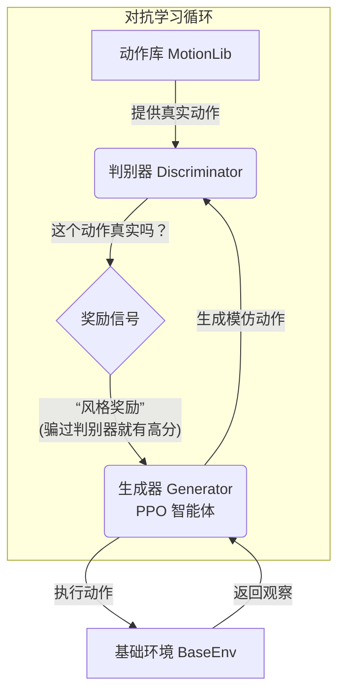
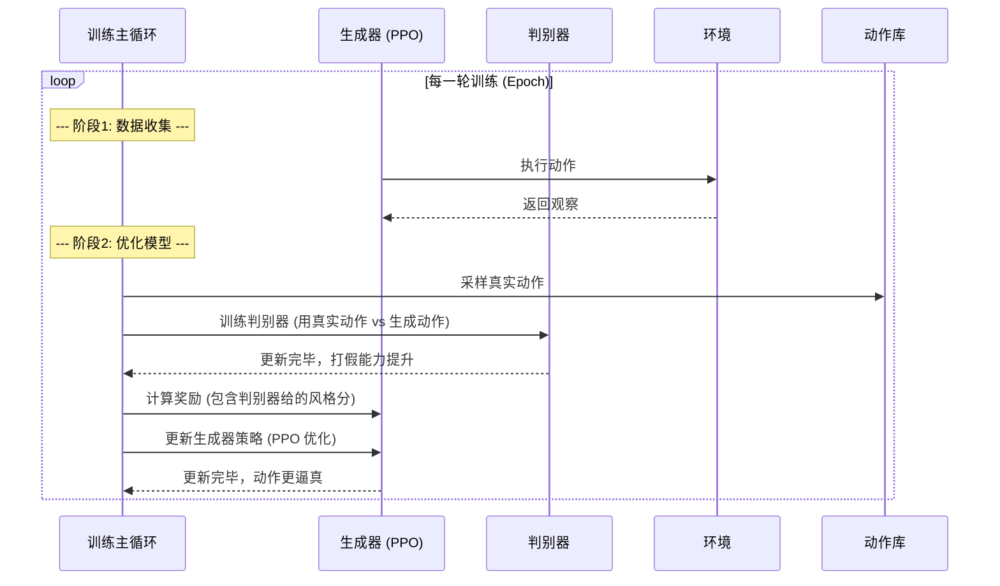

---
{"publish":true,"created":"2025-10-22T19:09:48.074-04:00","modified":"2025-11-02T15:44:35.827-05:00","tags":["ai","code2tutorial","diffusion","manipulation"],"cssclasses":""}
---


# Chapter 6: AMP 智能体 (对抗性运动先验)


在上一章 [基础强化学习智能体 (PPO)](05_基础强化学习智能体__ppo__.md) 中，我们认识了一个像婴儿一样从零开始学习的智能体。它可以通过奖励和惩罚，独立地学会完成一些简单任务，比如站立。但是，你可能会发现，它完成任务的姿势可能非常“机器人化”、僵硬，甚至有些古怪。它只关心“完成任务”，而不在乎动作是否“优美”或“自然”。

那么，我们如何才能教会智能体不仅要完成任务，还要让它的动作看起来像一个真正的人类呢？

答案就是引入一位“舞蹈老师”和一位“舞蹈评论家”。这就是我们本章的主角——AMP 智能体。

## 什么是 AMP 智能体？

AMP (Adversarial Motion Priors, 对抗性运动先验) 是一种先进的模仿学习技术。它的核心思想非常有趣，就像一场发生在学生和评论家之间的“猫鼠游戏”。

想象一下：
*   **学生 (我们的 PPO 智能体)**：他想成为一名舞蹈家，于是努力地创造自己的舞蹈动作。我们称他为**生成器 (Generator)**。
*   **舞蹈录像带 (动作库)**：这里存放着成千上万段由专业舞者跳的真实舞蹈片段，也就是我们的 [动作库 (MotionLib)](04_动作库__motionlib__.md)。
*   **评论家 (一个新网络)**：他是一位眼光毒辣的舞蹈评论家。他的唯一工作就是分辨一段舞蹈是来自真实的“舞蹈录像带”，还是“学生”自己编的。我们称他为**判别器 (Discriminator)**。

学习的过程是这样的：

1.  学生（生成器）跳一段自己编的舞，然后拿给评论家看。
2.  评论家同时也会观看一段来自真实录像带的舞蹈。
3.  评论家给出他的判断：“嗯，你这段舞看起来有点假，不像真人跳的。” 或者 “哇，你这段舞太棒了，我差点以为是专业舞者跳的！”
4.  **关键来了**：
    *   **学生的目标**：是跳出能够“骗过”评论家的舞蹈。每当他成功骗过评论家一次，我们就会给他大量的**奖励**。为了得到这个“风格奖励”，他被迫让自己的动作越来越逼真、自然。
    *   **评论家的目标**：是变得越来越擅长“打假”，火眼金睛地分辨出学生和专业舞者的区别。

这场永无止境的对抗，最终会把学生（我们的智能体）锤炼成一位动作与真人无异的“舞蹈大师”。



## AMP 的两大核心组件

AMP 智能体在 [基础强化学习智能体 (PPO)](05_基础强化学习智能体__ppo__.md) 的基础上，增加了一个关键组件：判别器。

### 1. 生成器 (Generator) - 我们的老朋友 PPO

生成器就是我们上一章学习的 PPO 智能体。它的工作没有变：观察环境，做出动作。只不过现在，它的奖励来源多了一个非常重要的部分——来自判别器的“风格奖励”。这会强烈地激励它去模仿人类的动作风格。

### 2. 判别器 (Discriminator) - 新来的“评论家”

判别器是一个独立的神经网络。它的结构很简单，通常是一个多层感知机 (MLP)。它的输入是一小段连续的动作姿态（比如过去0.5秒内的所有关节角度），输出则是一个简单的评分：这个动作有多大概率是“真实”的。

这个判别器是在 `protomotions/agents/amp/model.py` 中定义的。

```python
# 文件: protomotions/agents/amp/model.py

# 判别器继承自一个带归一化的 MLP
class Discriminator(MLP_WithNorm):
    def __init__(self, config, num_in: int, num_out: int):
        super().__init__(config, num_in, num_out)

    # ... 其他方法 ...

    # 计算奖励的核心方法
    def compute_reward(self, input_dict: dict, eps: float = 1e-7) -> torch.Tensor:
        # s 是判别器给出的“真实度”评分 (0到1之间)
        s = self.forward(input_dict)
        s = torch.clamp(s, eps, 1 - eps)
        # 评分越高，奖励越高
        reward = -(1 - s).log()
        return reward
```
`compute_reward` 方法非常关键。它将判别器的“真实度”评分 `s` 转换成了一个奖励值。如果评分 `s` 接近 1（判别器认为动作很真实），`reward` 就会是一个很大的正数。反之，如果 `s` 接近 0，奖励就会是负数。

而整个 `AMP` 智能体的模型 `AMPModel`，则是在 `PPOModel` 的基础上，简单地增加了一个判别器实例。

```python
# 文件: protomotions/agents/amp/model.py

class AMPModel(PPOModel):
    def __init__(self, config):
        # 先初始化 PPO 的演员和评论家
        super().__init__(config)
        # 再额外创建一个判别器
        self._discriminator: Discriminator = instantiate(
            self.config.discriminator,
        )
```

## AMP 的训练流程

AMP 的训练分为两个交替进行的部分：**训练判别器**和**训练生成器**。

### 1. 训练判别器 (`discriminator_step`)

首先，我们要让评论家学会如何“打假”。我们会从三个地方抽取动作数据喂给它：

1.  **真实数据 (Expert)**：从 [动作库 (MotionLib)](04_动作库__motionlib__.md) 中随机采样。
2.  **生成数据 (Agent)**：智能体在环境中刚刚生成的动作。
3.  **历史数据 (Replay)**：从一个“回放池”中采样智能体过去生成过的动作，防止它忘记过去的错误。

然后，我们告诉判别器：“第一种是‘真’的，后两种是‘假’的，你自己学着分辨吧！” 这本质上是一个简单的二分类问题。

```python
# 文件: protomotions/agents/amp/agent.py (简化版)

def discriminator_step(self, batch_dict):
    # 从批次数据中获取三种动作
    agent_obs = batch_dict["agent_historical_self_obs"]
    replay_obs = batch_dict["replay_historical_self_obs"]
    expert_obs = batch_dict["expert_historical_self_obs"]

    # ... (让判别器对它们进行打分) ...
    agent_logits = self.model._discriminator.compute_logits(agent_obs)
    expert_logits = self.model._discriminator.compute_logits(expert_obs)

    # 计算损失：
    # - 对于真实动作，我们希望它的得分 (logit) 越高越好
    expert_loss = -torch.nn.functional.logsigmoid(expert_logits).mean()
    # - 对于生成动作，我们希望它的得分越低越好
    agent_loss = torch.nn.functional.softplus(agent_logits).mean()
    
    # 总损失 = 真实损失 + 生成损失
    class_loss = 0.5 * (expert_loss + agent_loss)
    
    return class_loss, {...}
```
通过最小化这个 `class_loss`，判别器的“打假”能力就会越来越强。

### 2. 训练生成器 (PPO 训练)

当判别器变得更聪明后，就轮到生成器（PPO 智能体）进行学习了。这个过程和我们上一章学的 PPO 几乎一样，唯一的区别在于**奖励的计算**。

在与环境互动的每一步，我们都会用当前“最新最强”的判别器来给智能体的动作打分，并把这个分数作为“风格奖励”。

```python
# 文件: protomotions/agents/amp/agent.py (简化版)

@torch.no_grad()
def calculate_extra_reward(self):
    # 获取智能体刚刚执行的一系列动作
    historical_self_obs = self.experience_buffer.historical_self_obs
    
    # 让判别器为这些动作打分，计算“风格奖励”
    amp_r = self.model._discriminator.compute_reward(
        {"historical_self_obs": historical_self_obs.view(...)}
    )

    # 还可以加上一些任务相关的奖励 (比如朝向目标)
    task_reward = super().calculate_extra_reward()
    
    # 总奖励 = 风格奖励 * 权重 + 任务奖励 * 权重
    extra_reward = amp_r * self.config.discriminator_reward_w + task_reward
    return extra_reward
```
有了这个强大的 `amp_r`（风格奖励），PPO 智能体在进行策略优化时，就会自然而然地朝着能够产生更逼真、更像人类的动作的方向去更新。它会发现，只要自己的动作足够“真”，就能轻松获得高额奖励。

整个训练过程可以用下面的时序图来表示：



## 总结

在本章中，我们学习了如何通过 AMP 让智能体的动作变得栩栩如生。

*   我们了解到 AMP 的核心是一种**对抗性学习**，它引入了一个**生成器**（PPO 智能体）和一个**判别器**（动作评论家）进行博弈。
*   我们探讨了这两个组件的角色：生成器努力**模仿**人类动作以“骗过”判别器，而判别器则努力学习以**分辨**真假动作。
*   我们学习了 AMP 的训练流程：交替训练判别器的**分类能力**和生成器的**模仿能力**。
*   最关键的一点是，判别器的判断被转化为了一个强大的**风格奖励信号**，引导 PPO 智能体生成越来越自然、逼真的动作。

AMP 是一种非常强大的技术，它将无监督的模仿学习（不需要精确到每一帧的模仿）与强化学习的目标导向能力完美结合。它让我们的虚拟角色不再是冷冰冰的机器人，而是拥有了“灵魂”的舞者。

然而，AMP 主要关注于动作的“风格”，对于需要精确复现特定动作序列的任务（比如，完全复刻一段舞蹈）可能不是最佳选择。在下一章，我们将学习另一种模仿学习方法，它更侧重于让智能体精确地“复刻”和“追踪”一个给定的参考动作。敬请期待：[MaskedMimic 智能体](07_maskedmimic_智能体_.md)。

---

Generated by [AI Codebase Knowledge Builder](https://github.com/The-Pocket/Tutorial-Codebase-Knowledge)