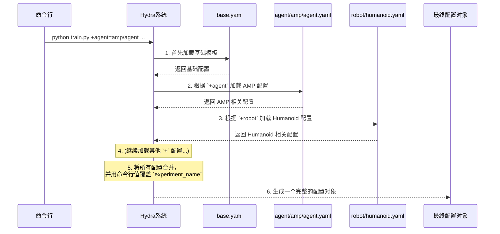

---
{"publish":true,"created":"2025-10-22T19:09:48.056-04:00","modified":"2025-11-02T15:44:43.406-05:00","tags":["ai","code2tutorial","diffusion","manipulation"],"cssclasses":""}
---


# Chapter 8: 训练与配置系统 (Hydra)


在上一章 [MaskedMimic 智能体](07_maskedmimic_智能体_.md) 中，我们认识了一位能够从不完整信息中进行预测和规划的“智能学生”。至此，我们已经探索了 `ProtoMotions` 项目中从环境、角色、动作库到各种核心智能体的所有关键组件。

我们现在拥有了一套完整的“乐高积木”：
-   不同的**场地** ([基础环境](01_基础环境__baseenv__.md))
-   不同的**物理引擎** ([模拟器抽象层](02_模拟器抽象层__simulator_abstraction__.md))
-   不同的**角色模型** ([骨骼与姿态表示](03_骨骼与姿态表示__poselib__.md))
-   不同的**训练大脑** ([PPO](05_基础强化学习智能体__ppo__.md), [AMP](06_amp_智能体__对抗性运动先验__.md), [MaskedMimic](07_maskedmimic_智能体_.md))

现在，最后一个问题是：我们如何像拼乐高一样，轻松地将这些积木组合起来，搭建出我们想要的实验，并启动它呢？这就需要一个强大而灵活的“控制中心”。这个控制中心，就是由一个名为 **Hydra** 的工具驱动的训练与配置系统。

## 什么是 Hydra 系统？

想象一下你在一家高科技的自助餐厅点餐。菜单上的菜品（比如主食、配菜、饮料）都是分开的，你可以自由组合。

-   **菜单**：就是 `ProtoMotions` 的 `config` 文件夹，里面有各种各样的配置选项，比如 `agent/ppo.yaml` (PPO大脑), `robot/humanoid.yaml` (人形机器人)。
-   **你的点餐单**：就是你在**命令行**中输入的指令。
-   **智能厨房**：就是 **Hydra**。它会根据你的点餐单，自动从菜单中取出对应的配置，组合成一份完整的套餐，然后开始“烹饪”（也就是开始训练或评估）。

`ProtoMotions` 项目的“控制中心”正是基于这套逻辑。它允许你通过简单的命令行指令，动态地组合不同的智能体、机器人模型、模拟器和环境设置，而无需修改任何一行代码。

这个系统的“电源按钮”是两个核心脚本：
-   `train_agent.py`：启动训练流程。
-   `eval_agent.py`：加载一个训练好的模型进行评估和可视化。

它们读取你的命令行“点餐单”，通过 Hydra 组装出实验配置，然后启动整个流程。

## 如何使用：一次典型的训练命令

让我们通过一个具体的例子，来看看这个系统有多么强大和便捷。

**我们的目标**：训练一个 [AMP 智能体](06_amp_智能体__对抗性运动先验__.md)，让它控制 `humanoid`（人形机器人）模型，在 `isaacgym` 模拟器中学习。我们还想给这个实验起个名字，叫 `my_first_amp_exp`。

你只需要在终端中输入下面这行命令：

```bash
python train_agent.py +agent=amp/agent +robot=humanoid +simulator=isaacgym experiment_name=my_first_amp_exp
```

就是这么简单！让我们来拆解一下这行命令，看看“智能厨房”Hydra是如何理解它的：

*   `python train_agent.py`：按下了“开始训练”的电源按钮。
*   `+agent=amp/agent`：这告诉 Hydra：“对于‘智能体’这个选项，请到 `config/agent` 目录下，找到并使用 `amp/agent.yaml` 这个配置文件。”
*   `+robot=humanoid`：同理，“对于‘机器人’选项，请使用 `config/robot/humanoid.yaml`。”
*   `+simulator=isaacgym`：同理，“对于‘模拟器’选项，请使用 `config/simulator/isaacgym.yaml`。”
*   `experiment_name=my_first_amp_exp`：这不是选择文件，而是在“**覆盖**”一个默认的配置参数。它告诉 Hydra：“把实验名称这个变量的值，设置为 `my_first_amp_exp`。”

Hydra 会在后台将所有这些零散的 YAML 配置文件和一个基础模板文件 `config/base.yaml` “合并”成一个巨大的、完整的配置对象。然后，`train_agent.py` 脚本就会使用这个最终配置来搭建和运行实验。

## 配置文件的“乐高积木”

这些可供我们自由组合的“乐高积木”都存放在 `protomotions/config/` 目录下。

```
protomotions/config/
├── agent/            # 存放所有智能体的配置
│   ├── amp/
│   │   └── agent.yaml
│   ├── ppo/
│   │   └── agent.yaml
│   └── masked_mimic/
│       └── agent.yaml
├── env/              # 存放环境的配置
├── robot/            # 存放机器人模型的配置
│   └── humanoid.yaml
├── simulator/        # 存放模拟器的配置
│   └── isaacgym.yaml
└── base.yaml         # 所有配置的基础模板
```

### 基础模板 (`base.yaml`)

`base.yaml` 是所有实验的“地基”。它定义了所有实验都共有的结构和默认值。

```yaml
# 文件: protomotions/config/base.yaml

# 定义所有配置都将使用的全局结构
defaults:
  - base/fabric
  - base/hydra
  - base/structure

# 这些是所有级别的配置都可以访问的全局变量
seed: 0
headless: True # 是否在无头模式下运行 (不显示图形界面)

# 实验命名和目录结构
experiment_name: ??? # ??? 表示这个值必须被命令行覆盖
base_dir: results
save_dir: ${base_dir}/${experiment_name} # 结果保存目录
```

这里的 `defaults` 列表指定了默认加载的组件。而 `${...}` 语法是变量插值，`save_dir` 的值会自动由 `base_dir` 和 `experiment_name` 拼接而成。

## 内部工作原理：Hydra 如何组装配置

当你运行那条训练命令时，Hydra 在幕后执行了一个清晰的合并流程：


这个过程的核心是**组合优于继承**。我们不是去修改一个巨大的配置文件，而是像搭积木一样，把一个个小的、功能单一的配置文件组合起来。这使得整个系统极具灵活性和可扩展性。

## “电源按钮”脚本的内部魔法

现在我们知道了配置是如何生成的，那么 `train_agent.py` 脚本又是如何使用这个配置的呢？

奥秘就在于两个关键的 Hydra 功能：`@hydra.main` 装饰器和 `instantiate` 函数。

让我们来看一个 `train_agent.py` 的**极度简化版**：
```python
# 文件: protomotions/train_agent.py

import hydra
from hydra.utils import instantiate

# 1. 这个装饰器将脚本与 Hydra 连接起来
@hydra.main(config_path="config", config_name="base")
def main(config: OmegaConf): # 2. Hydra 会自动传入最终配置
    # ... 其他设置 ...

    # 3. Hydra 根据配置自动创建对象实例
    #    它会查找 config.env._target_ 指定的类
    env = instantiate(config.env, device=fabric.device)
    
    #    同理，自动创建智能体实例
    agent: PPO = instantiate(config.agent, env=env, fabric=fabric)

    # 4. 开始训练
    agent.fit()

if __name__ == "__main__":
    main()
```

这里有几个“魔法”般的关键点：

1.  `@hydra.main(...)`：这个 Python 装饰器告诉 Hydra：“这个函数是我的主入口。请在运行它之前，先去 `config` 目录下，以 `base.yaml` 为基础，解析命令行参数，然后把最终的配置准备好。”
2.  `main(config: OmegaConf)`：Hydra 会将上一步生成的那个完整的配置对象，自动作为参数 `config` 传递给 `main` 函数。现在，`config` 就像一个包含了所有实验设置的巨大字典。
3.  `instantiate(config.agent, ...)`：这是 Hydra 最神奇的功能。它会查看 `config.agent` 这个配置块。在每个配置文件（比如 `agent/amp/agent.yaml`）中，都有一个特殊的键 `_target_`，它指定了这个配置对应的 Python 类路径（例如 `_target_: protomotions.agents.amp.agent.AMP`）。`instantiate` 函数会自动找到这个类，并将配置文件中的其他所有键值对作为参数来创建这个类的实例。

这个过程完全是自动化的！`train_agent.py` 的代码里没有任何 `if agent_type == "amp": ... elif agent_type == "ppo": ...` 这样的判断语句。代码是完全通用的，它只是简单地说：“Hydra，请根据 `config.agent` 的内容，给我创建一个智能体。” 这使得添加新的智能体或机器人变得异常简单——你只需要写好新的类和对应的 YAML 配置文件，整个系统就能自动识别并使用它。

## 总结

在本章中，我们揭开了 `ProtoMotions` 项目“控制中心”的神秘面纱。

*   我们了解到，整个训练和评估流程是由 **Hydra** 配置系统驱动的，它就像一个智能厨房，可以根据你的命令行“点餐单”来组装实验。
*   我们学习了如何通过简单的命令行参数（如 `+agent=...`, `+robot=...`）来**自由组合**不同的组件，实现高度灵活的实验配置。
*   我们探讨了 `config` 目录的结构，理解了它是由许多可复用的“乐高积木”（小的 YAML 文件）和一个基础模板 `base.yaml` 构成的。
*   我们还深入了解了 `train_agent.py` 脚本中的核心魔法：`@hydra.main` 装饰器负责加载配置，而 `instantiate` 函数则根据配置**自动创建**相应的对象实例，实现了代码与配置的完美解耦。

---

**祝贺你！**

你已经完成了 `ProtoMotions` 核心概念的全部学习旅程。从最底层的[基础环境](01_基础环境__baseenv__.md)，到驱动它的[模拟器](02_模拟器抽象层__simulator_abstraction__.md)，再到角色的[骨骼与动作](03_骨骼与姿态表示__poselib__.md)，以及各种越来越强大的智能体大脑——[PPO](05_基础强化学习智能体__ppo__.md)、[AMP](06_amp_智能体__对抗性运动先验__.md) 和 [MaskedMimic](07_maskedmimic_智能体_.md)，最后到今天我们学习的这个强大的“控制中心”。

你现在已经对 `ProtoMotions` 的整体架构有了全面而深入的理解。你已经准备好，可以开始动手组合这些强大的工具，去探索、创造和训练你自己的虚拟角色了。祝你在虚拟世界中玩得愉快！

---

Generated by [AI Codebase Knowledge Builder](https://github.com/The-Pocket/Tutorial-Codebase-Knowledge)