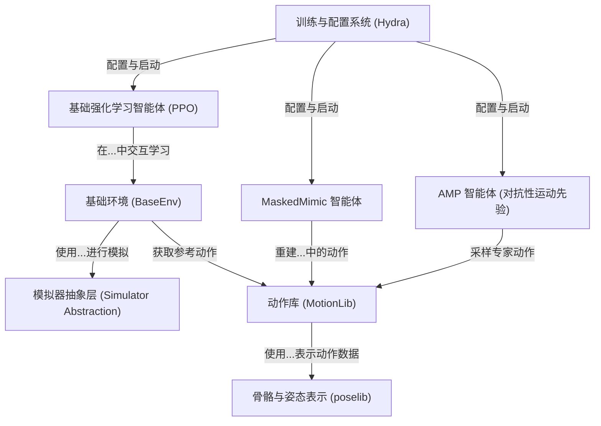

---
{"publish":true,"created":"2025-10-22T19:09:48.083-04:00","modified":"2025-11-02T15:44:56.280-05:00","tags":["ai","code2tutorial","diffusion","manipulation"],"cssclasses":""}
---

# Tutorial: ProtoMotions

ProtoMotions 是一个用于创建*物理模拟虚拟角色*的框架。你可以把它想象成一个高级的“数字木偶剧场”，在这里，虚拟角色不再是预设动画的播放器，而是学会了如何像真实世界一样，遵循**物理定律**来移动、行走、甚至完成复杂动作。项目通过**强化学习**和**模仿学习**等技术，让角色能够从*动作捕捉数据*中学习，从而展现出高度逼真和可交互的行为。

**Source Repository:** [https://github.com/NVlabs/ProtoMotions](https://github.com/NVlabs/ProtoMotions)

## Chapters

1. [基础环境 (BaseEnv)
](01_基础环境__baseenv__.md)
2. [模拟器抽象层 (Simulator Abstraction)
](02_模拟器抽象层__simulator_abstraction__.md)
3. [骨骼与姿态表示 (poselib)
](03_骨骼与姿态表示__poselib__.md)
4. [动作库 (MotionLib)
](04_动作库__motionlib__.md)
5. [基础强化学习智能体 (PPO)
](05_基础强化学习智能体__ppo__.md)
6. [AMP 智能体 (对抗性运动先验)
](06_amp_智能体__对抗性运动先验__.md)
7. [MaskedMimic 智能体
](07_maskedmimic_智能体_.md)
8. [训练与配置系统 (Hydra)
](08_训练与配置系统__hydra__.md)

---

Generated by [AI Codebase Knowledge Builder](https://github.com/The-Pocket/Tutorial-Codebase-Knowledge)